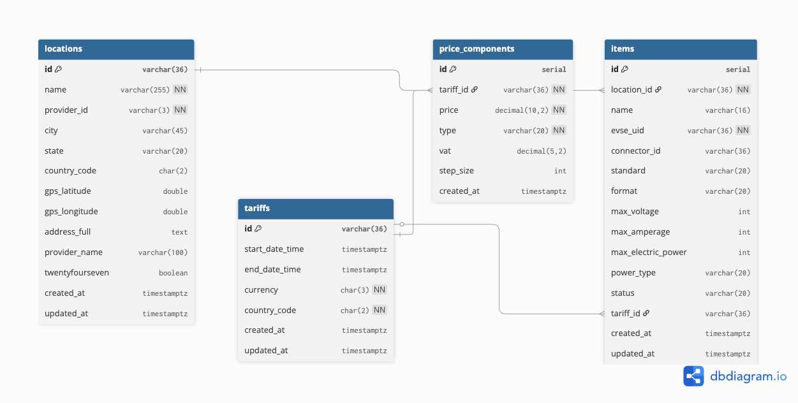

# Beckn OCPI Adaptor

> 🚧 **Work in Progress** - This project is under active development and all endpoints are not implemented.

A TypeScript-based adaptor that bridges the Beckn Protocol with the Open Charge Point Interface (OCPI) standard, enabling seamless integration between Beckn network participants and OCPI-compliant charging station operators.

## Features

- OCPI 2.2.1 compliant interface
- Beckn Protocol v1.0 and v2.0 flows (switchable via configuration)
- OCPI tariff and connector mapping with computed power profiles
- Beckn v2 `discover` support with spatial filtering
- Quote and order normalisation (offer/payment/buyer sanitisation)
- Optional ClickHouse-backed logging with graceful fallback

## API Endpoints

- `POST /discover` – Beckn v2 discovery flow (returns an on_discover payload)
- `POST /search` – Beckn v1 search handler (`501` when version is set to 2.0)
- `POST /select` – Select handler (maps accepted offers & payment methods)
- `POST /init` – Init handler (normalises buyer/offers before responding)
- `POST /auto` – Smart dispatcher that routes to `search`, `select`, or `init` based on request context
- `GET /beckn-logs` – Query ClickHouse-backed interaction logs (parameters: `transaction_id`, `message_id`, `bap_id`, `protocol`, `action`, `stage`, `status`, `method`, `since`, `limit`)
- `GET /health` – Simple health check returning `200 OK`

## Prerequisites

- Node.js 16+
- Redis 6+
- ClickHouse 23+
- npm or yarn
- OCPI 2.2+ compatible server credentials
- Docker & Docker Compose (for container deployment)

## Local Installation

1. Clone the repository:
   ```bash
   git clone https://github.com/beckn/beckn-ocpi-adaptor.git
   cd beckn-ocpi-adaptor
   ```

2. Install dependencies:
   ```bash
   npm install
   # or
   yarn install
   ```

3. Set up environment variables(optional):
   ```bash
   cp .env.example .env
   # Update the .env file with your configuration
   ```
You can set the environment variables in any other method as well. Dotenv has been setup to set the variables if .env file is present.

4. Run in developer mode:
   ```bash
   npm run dev -- --config ./path/to/config/file.yaml
   ```
If config argument is not passed then it will look for default.yaml file in ./config folder. So to use default config file just run:
```bash
npm run dev
```


## Container Deployment

This repository ships with a production-ready `Dockerfile` and an extended `docker-compose.yml` inspired by the [beckn/sandbox](https://github.com/beckn/sandbox) project. The stack brings up the adaptor alongside Redis and ClickHouse with one command.

### 1. Prepare environment variables

```bash
cp .env.example .env
```

Update the values for your deployment. When using Docker Compose, set the cache and ClickHouse hosts to the service names defined in the compose file:

```env
CACHE_HOST=redis
CACHE_PORT=6379
CACHE_TTL_SECONDS=300
CLICKHOUSE_HOST=clickhouse
CLICKHOUSE_PORT=8123
```

You can maintain a second `.env` (e.g. `.env.local`) with `CACHE_HOST=127.0.0.1` for non-container development and swap files by adjusting the `env_file` entry in `docker-compose.yml`.

### 2. Start the stack with Docker Compose

```bash
docker compose up --build
```

Compose will provision:

- `app`: the Beckn ↔ OCPI adaptor listening on port `4000`
- `redis`: backing cache (data persisted in the `redis-data` volume)
- `clickhouse`: log store (data persisted in the `clickhouse-data` volume)

The compose file injects `.env` variables and overrides the cache/log hosts so the adaptor can talk to the companion containers immediately.

### 3. Build & run the image manually (optional)

```bash
docker build -t beckn-ocpi-adaptor:latest .
docker run --rm -p 4000:4000 \
  --env-file .env \
  -e CACHE_HOST=<redis-host> \
  -e CACHE_PORT=6379 \
  -e CLICKHOUSE_HOST=<clickhouse-host> \
  -e CLICKHOUSE_PORT=8123 \
  beckn-ocpi-adaptor:latest
```

Override `CACHE_HOST`/`CLICKHOUSE_HOST` with the addresses of your managed Redis or ClickHouse services. To load a non-default config file, append `--config /app/config/custom.yaml` to the container command (or override `command:` in the compose file).


## Configuration

### Configuration File

All configuration is done through the configuration file. The default configuration file used is `config/default.yaml`. This can be changed by using the `--config` argument while running the adaptor. Here's a complete example with all available options in the config file:

```yaml
# Environment settings
node_env: development  # development, production, or test
port: 3000  # Port to run the server on

# OCPI Configuration
ocpi:
  url: https://ocpi.example.com/ocpi/cpo/2.2.1  # Base URL for OCPI API
  auth_key: your_ocpi_auth_key_here  # Authentication key for OCPI API

# Beckn Protocol Configuration
beckn:
  version: "1.0"  # Beckn protocol version (1.0 or 2.0)
  bpp_id: your_bpp_id  # Your Beckn Protocol Provider ID
  bpp_uri: https://your-bpp-uri.com  # Base URI for your BPP
  protocol_server_url: https://protocol-server.example.com  # Beckn Protocol Server URL

cache:
  host: ${CACHE_HOST}     # Redis host (e.g. 127.0.0.1 locally, `redis` in Docker)
  port: ${CACHE_PORT}     # Redis port (typically 6379)
  password: ${REDIS_PASSWORD}   # Redis password (set in environment)
  ttl_seconds: ${CACHE_TTL_SECONDS} # Default TTL for cached OCPI data

clickhouse:
  host: ${CLICKHOUSE_HOST}  # ClickHouse host (e.g. 127.0.0.1 locally, `clickhouse` in Docker)
  port: ${CLICKHOUSE_PORT}  # ClickHouse HTTP port
  database: default    # Database where logs are stored
  username: default    # ClickHouse username
  password: ""         # ClickHouse password (blank if not set)
  log_table: app_logs  # Table used to persist application logs

# Application specific configuration
app:
  discovery:
    default_radius_meters: 5000  # 5km default search radius
    standard_session_kwh: 1      # Default session size in kWh
    share_location_details: true  # Whether to share location details on discovery
  initialization:
    refresh_ocpi_cache_on_startup: true  # Refresh the OCPI cache during startup
    use_cache: true  # Use the database cache instead of calling OCPI live for discovery data
  
  # Cancellation terms (optional)
  cancellation_terms:
    - fulfillment_state: confirmed
      cancellation_fee:
        percentage: 30  # Percentage of total amount to charge for cancellation
  
  defaults:
    item_name: 'EV Charger'  # Default item name to use
```

### Configuration Reference

#### OCPI
- `ocpi.url`: Base URL of the OCPI server
  - Example: `https://ocpi.example.com/ocpi/cpo/2.2.1`
- `ocpi.auth_key`: Authentication key for OCPI API

#### Beckn
- `beckn.version`: Target Beckn protocol version
  - `"1.0"` or `"2.0"`
- `beckn.bpp_id`: Your Beckn Protocol Provider ID
  - Example: `bpp.example.com`
- `beckn.bpp_uri`: Base URI for your BPP
  - Example: `https://bpp.example.com`
- `beckn.protocol_server_url`: Beckn Protocol Server URL
  - Example: `https://protocol.example.com`

- `cache.host`: Redis host
  - Example: `127.0.0.1` (set to `redis` when running via docker compose)
- `cache.port`: Redis port
  - Example: `6379`
- `cache.password`: Redis password used when authentication is enabled
  - Example: `${REDIS_PASSWORD}`
- `cache.ttl_seconds`: Default TTL (in seconds) for cached OCPI payloads
  - Example: `300`
- `clickhouse.host`: ClickHouse server host
- `clickhouse.port`: ClickHouse HTTP port (default `8123`)
- `clickhouse.database`: Target database for log storage
- `clickhouse.username`: ClickHouse username (default `default`)
- `clickhouse.password`: ClickHouse password
- `clickhouse.log_table`: Table name for application logs (default `app_logs`)


#### Application Settings
- `app.discovery.default_radius_meters`: Default search radius in meters
  - Example: `5000` (5km)
- `app.discovery.standard_session_kwh`: Default session size in kWh
  - Example: `1`
- `app.discovery.share_location_details`: Whether to share location details
  - `true` or `false`
- `app.initialization.refresh_ocpi_cache_on_startup`: Refreshes the OCPI cache when the adaptor boots
  - `true` or `false`
- `app.initialization.use_cache`: When `false`, discovery data is fetched live from the OCPI server instead of the database cache
  - `true` or `false`
- `app.defaults.item_name`: Default item name
  - Example: `'EV Charger'`

### Using Environment Variables
You can provide environment variables in the config yaml file using the following format:
```
${ENV_VARIABLE_NAME}
```

## Data Models and Beckn Mappings

The data models andbeckn mappings are detailed in the [model.md](./ref_docs/model.md) file.



## Usage

Start the development server:
```bash
npm run dev -- --config ./path/to/config/file.yaml
```
If config argument is not passed then it will look for default.yaml file in ./config folder. So to use default config file just run:
```bash
npm run dev
```

Build for production:
```bash
npm run build
npm start -- --config ./path/to/config/file.yaml
```
If config argument is not passed then it will look for default.yaml file in ./config folder. So to use default config file just run:
```bash
npm run build
npm start
```

Run discovery service:
```bash
npm run discovery
```
This can be scheduled to run at regular intervals using a task scheduler like cron.

## Contributing

We welcome contributions! Here's how you can help:

1. **Fork** the repository
2. Create a **feature branch** (`git checkout -b feature/AmazingFeature`)
3. **Commit** your changes (`git commit -m 'Add some AmazingFeature'`)
4. **Push** to the branch (`git push origin feature/AmazingFeature`)
5. Open a **Pull Request**

### Reporting Issues

Found a bug? Please help us by [opening an issue](https://github.com/beckn/beckn-ocpi-adaptor/issues/new) with:
- Clear title and description
- Steps to reproduce
- Expected vs actual behavior
- Environment details
- Logs if applicable

### Pull Request Guidelines

- Update documentation as needed
- Follow the existing code style
- Keep PRs focused on a single feature/fix
- Reference related issues in your PR

## License

This project is licensed under the MIT License - see the [LICENSE](./LICENSE) file for details.
